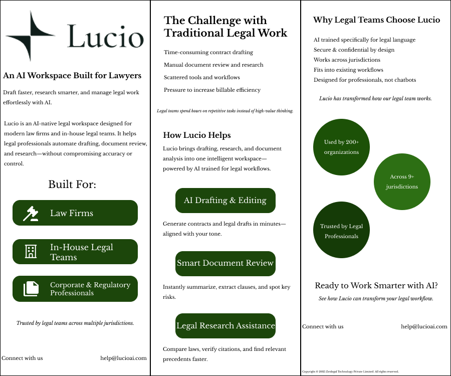

# ⚖️ Lucio – AI Workspace for Lawyers

A modern legal-tech website and brochure UI/UX concept designed in Figma for AI-powered legal workflow management.

Lucio is designed as an AI-native workspace for law firms and in-house legal teams, helping professionals streamline drafting, research, document review, and legal operations with a clean and trustworthy digital experience.
[Prototype](https://www.figma.com/proto/nhQl5S5MQS8oNbPVeSlb9T/lucio-version?node-id=14-2&t=r5edFxPVtIyJwVkw-1)
---

# ✨ Project Overview

This project includes:
- 🌐 Website Landing Page Design
- 📄 Marketing Brochure Design
- 🧩 Reusable UI Components
- 🎨 Legal-tech Branding System
- 📱 Responsive Web Layout Concepts
- ⚖️ Professional User Experience Design

---

# 🎯 Project Goal

The goal of this project was to:
- Create a trustworthy legal-tech identity
- Design a modern AI-powered platform experience
- Improve legal workflow accessibility
- Build a structured and scalable UI system
- Communicate professionalism and security through design

---

# 🖌️ Features

## 🌐 Website Features
- Hero Section with CTA
- Legal AI Product Showcase
- ROI Metrics Section
- Security & Compliance Area
- Practice Area Solutions
- Responsive Layout Structure
- Modern Navigation System
- Trusted Organizations Section

---

## 📄 Brochure Features
- Company Introduction
- Legal Workflow Challenges
- AI Feature Explanations
- Practice-focused Solutions
- Trust & Statistics Display
- Professional Contact Layout

---

# 🎨 Design Style

- Minimal & premium aesthetic
- Editorial-inspired layouts
- Deep green legal-tech branding
- Strong typography hierarchy
- Professional enterprise feel
- Trust-focused visual system

---

# 🛠️ Design Process

## 1. Research
Focused on understanding:
- Legal-tech platforms
- Lawyer workflow pain points
- Enterprise SaaS layouts
- Trust-building UX patterns

---

## 2. Wireframing
Created structured layouts for:
- Hero sections
- Feature blocks
- Metrics displays
- Information hierarchy
- Brochure content flow

---

## 3. High-Fidelity UI Design
Designed polished interfaces with:
- Consistent spacing
- Clear hierarchy
- Legal-tech branding
- Modern CTA placement
- Minimal professional styling

---

## 4. Component System
Built reusable UI components for:
- Buttons
- Navigation items
- Statistic cards
- Feature sections
- Content layouts

---

# 🧰 Tools Used

- Figma
- Auto Layout
- UI Components
- UX Research
- Design Systems
- Typography & Branding

---

# 📱 Screens Included

## Website
- Landing Page
- Features Section
- ROI Metrics Area
- Practice Solutions
- Security & Compliance
- Footer Design

---

## Brochure
- Cover Layout
- AI Solutions Overview
- Legal Workflow Challenges
- Feature Highlights
- Statistics & Trust Sections

---

# 🚀 Future Improvements

- Dark Mode
- Interactive Prototype
- Full Responsive Development
- AI Chat Integration
- Animated UI Interactions
- Dashboard Expansion

---

# 💡 Learning Outcomes

Through this project, I improved my skills in:
- SaaS Website Design
- Enterprise UX
- Legal-tech Branding
- Information Hierarchy
- Editorial Layout Design
- UI Consistency
- Professional Product Presentation

---

# 📸 Preview

## 🌐 Website Landing Page

  

---

## 📄 Marketing Brochure

  

---

# 🤝 Feedback

Feedback and suggestions are always welcome!

If you liked this project:
- ⭐ Star the repository
- 🍴 Fork the project
- 📢 Share your thoughts

---

# 📌 Connect With Me

Feel free to connect and share your feedback about the project!
